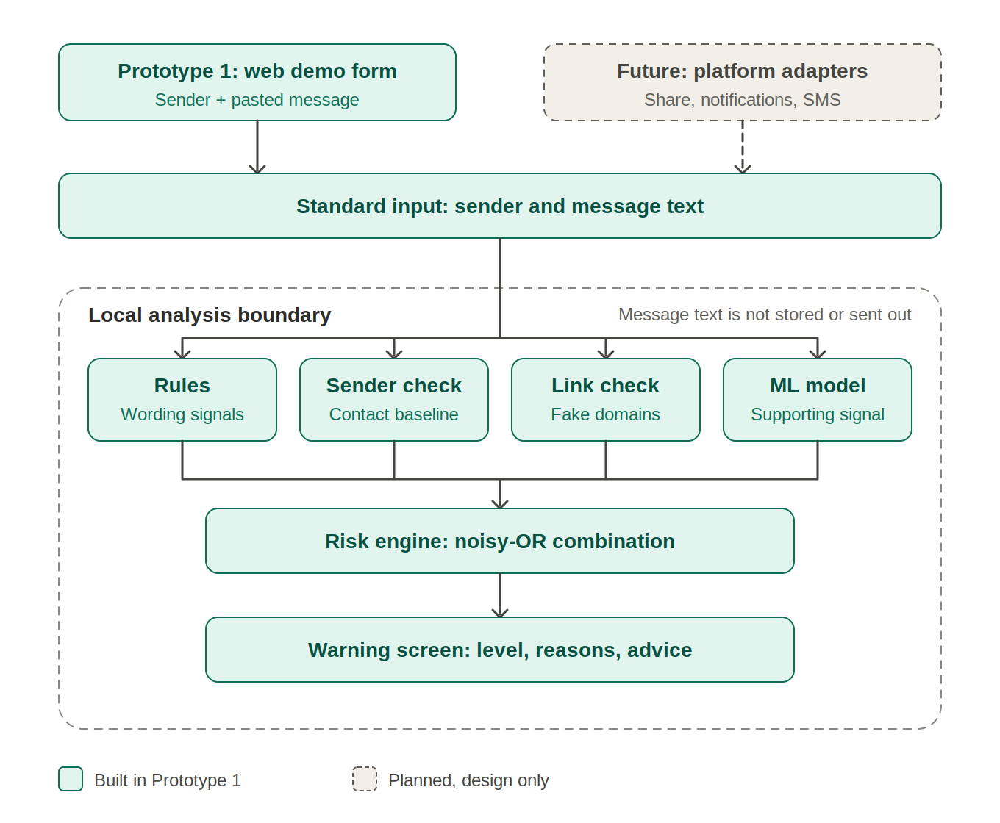
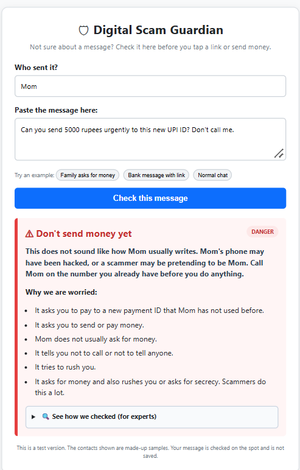
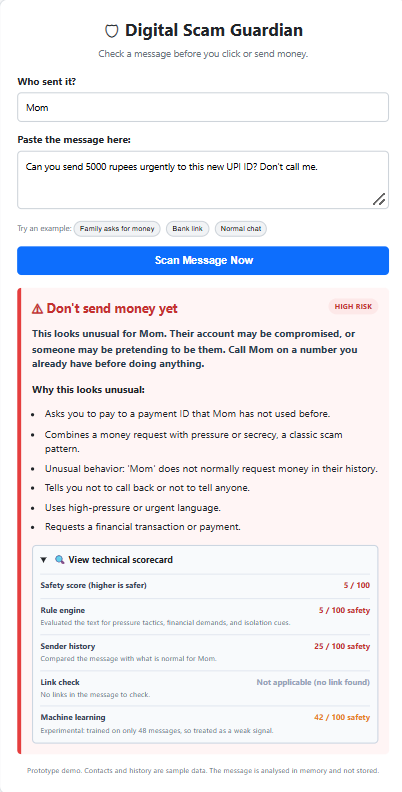
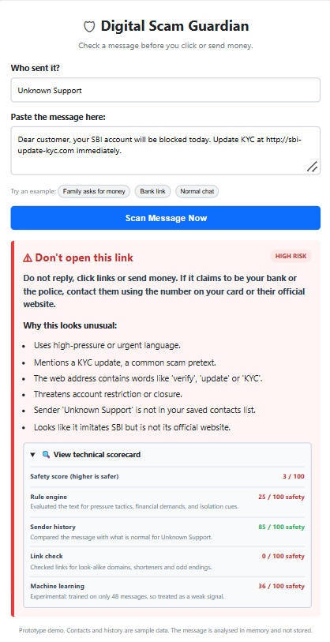
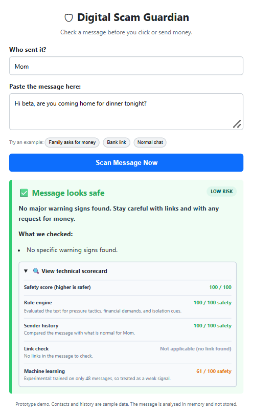
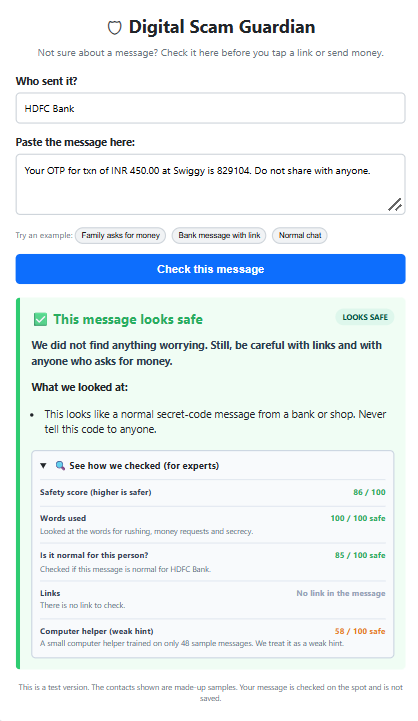
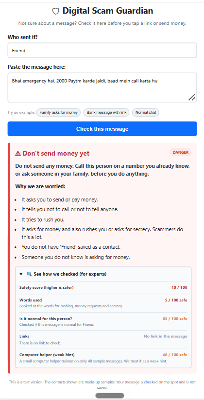
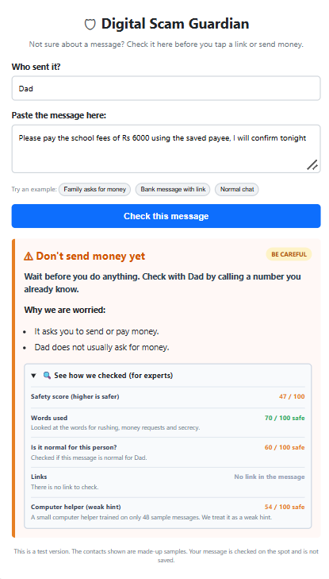

# Digital Scam Guardian

A scam-safety layer for messages, **designed first for elderly people and useful to anyone**.
It checks a message on the user's own device, then explains in plain language why the message looks risky and what to do.

Built for the **Tata Young Social Innovator Challenge** (Technology for Social Good: *how can an elderly person tell whether a call, link or message is genuine or a scam?*).

> **Status: Prototype 1.** A working web demo of the detection approach. It does **not** read WhatsApp or SMS yet, and it does not handle phone calls.

<!-- Add screenshots here once taken, for example:


-->

## The problem
Scammers do not hack elderly people's phones; they persuade them, using urgency, fear, authority and trust.
Many tools only check whether a number or link is on a blocklist. That misses brand-new links, and it misses messages from a known contact whose account has been hacked or imitated.

## What it does
Four layers each produce a risk, and a strong signal in any layer raises the final verdict.

| Layer | What it checks |
|---|---|
| Rules | Urgency, requests to send money, secrecy ("don't call me"), OTP/PIN requests, threats, fake authority (police, arrest), prize claims |
| Sender baseline | Is this unusual for this contact? For example, someone who never asks for money suddenly does, to a new payment ID |
| Links | Shorteners, look-alike bank domains, odd endings, scam words in the address (local checks only) |
| ML model | Small text classifier used as a supporting signal; counted only when more than 50% confident |

- **Combination:** noisy-OR, `risk = 1 - product(1 - layer_risk x trust)`, not a plain average. A clearly fake link cannot be diluted away by clean-looking text.
- **Levels:** LOOKS SAFE, BE CAREFUL, DANGER (internally LOW, SUSPICIOUS, HIGH), each with short reasons and clear advice.
- **Plain language:** short sentences and everyday words, written after feedback that a first version was too technical. Messages say things like "may have been hacked" or "a scammer may be pretending", never claim certainty, and a known contact is not automatically treated as safe.

## Architecture



*Solid = built in Prototype 1. Dashed = planned, design only. Vector version: [docs/architecture.svg](docs/architecture.svg).*

| Component | Role | File |
|---|---|---|
| Web demo form | Prototype 1 entry point: sender + pasted message, plus example buttons | `frontend/index.html` |
| Standard input / API | One input format for any source (`POST /api/analyze`) | `backend/main.py` |
| Rules | Wording signals: urgency, money requests, secrecy, OTP/PIN, threats, authority, prizes | `detector/detector.py` |
| Sender check | Compares the message with the contact's baseline (sample data) | `detector/contact_analyzer.py` |
| Link check | Local heuristics on links, no network calls | `detector/link_analyzer.py` |
| ML model | Small supporting text classifier, trained once per run | `detector/train_model.py` |
| Risk engine | Combines the layers (noisy-OR), writes reasons and advice | `detector/risk_engine.py` |

**How a message flows:** it enters as `sender + text`, the four layers each return a risk and plain-language reasons, the risk engine combines them into LOW, SUSPICIOUS or HIGH, and the page shows a headline, advice and reasons. Nothing is blocked automatically, and the text is not stored.

**Design choices:**
- *Platform-independent core:* the engine only sees `sender + text`, so it does not depend on any one messaging app.
- *Local analysis:* the engine needs no external service, so message text stays inside the app.
- *Signals combined, not averaged:* a clearly fake link or an unusual money request cannot be diluted by clean-looking wording.
- *Explain, don't just score:* every result lists its reasons; wording is "this looks unusual", never "this is a scam".

### How it is designed to fit existing messaging apps (design only, not built)
Encrypted apps such as WhatsApp cannot be read by a server, so a real layer must work **on the user's own device after a message is delivered**. Three routes are planned, each subject to platform permissions and policies (iOS is more restrictive than Android):

| Route | Idea | Notes |
|---|---|---|
| Share to Guardian | The user shares a suspicious message from any app into Guardian | User-initiated; needs no special permission |
| Notification access (Android) | With the user's explicit permission, Guardian reads incoming notification text and shows a warning | Permission and store-policy limits apply |
| SMS filtering | Integrate with the platform's SMS filtering options | Rules differ by platform; may only cover some senders |

Prototype 1 implements none of these routes; it demonstrates the detection engine that they would all feed.

## Screenshots

**A known contact asks for money, to a new payment ID** (high risk, with plain-language reasons):



**Technical scorecard** (each layer shown separately; the ML signal is deliberately weak and the rules and sender history drive the verdict):



**Fake bank link:**



**Normal message and a genuine OTP notice** (no false alarm):

 

**Hinglish scam** and a **known limitation** (a genuine fee message gets a moderate warning):

 


## Run it
Run these from the project root.
```
python -m venv .venv
source .venv/bin/activate          # Windows: .venv\Scripts\activate
pip install -r requirements.txt
uvicorn backend.main:app --reload
```
Open http://127.0.0.1:8000 (in GitHub Codespaces, open the forwarded port).
Three example buttons on the page load a sample scam, a fake link and a normal message.

## Test it
```
python tests/run_scenarios.py                   # 9 demo scenarios with pass/fail
python tests/evaluate.py data/dev_messages.json # development set
python tests/evaluate.py                        # hold-out set (data/test_messages.json)
python detector/train_model.py                  # ML training info
```

## Results
"Flagged" means SUSPICIOUS or HIGH RISK.

| Set | Messages | TP | FP | TN | FN | Accuracy | Precision | Recall |
|---|---|---|---|---|---|---|---|---|
| Development (used for tuning) | 48 | 24 | 1 | 20 | 3 | 91.7% | 96.0% | 88.9% |
| Hold-out (run once, not tuned on) | 32 | 14 | 4 | 14 | 0 | 87.5% | 77.8% | 100% |

On the hold-out set, all 14 scam or suspicious messages were flagged, and 4 of 18 genuine messages received a moderate (SUSPICIOUS) warning. None of the genuine messages was marked HIGH RISK.

Evidence (terminal output): [scenarios](docs/screenshots/08-scenarios.png), [development set](docs/screenshots/09-dev-results.png), [hold-out set](docs/screenshots/10-holdout-results.png), [ML training info](docs/screenshots/11-ml-info.png).

**Please read these numbers carefully.**
- The sets are small, so results are indicative only. With 32 messages the true accuracy could plausibly lie between roughly 72% and 95%.
- Both sets were written by the project team with help from an AI assistant, so they are less independent than real-world data. Replacing or adding messages from public awareness material is planned.
- The hold-out set was run once. After looking at its mistakes it is no longer a clean test; further changes need a new hold-out set.

**Known mistakes (hold-out):** genuine messages about bills, fees and delivery OTPs can trigger a mild warning, for example "Share OTP only with the delivery partner", or a request to pay a school fee.
**Known misses (development):** polite scams with no link and no pressure, such as a part-time job offer or a calm "please call us back" message.

**ML model:** trained on the 48 development messages only (no public dataset yet), so it is marked *experimental* in the app and given low weight. It has not been validated on Indian UPI scams. If the UCI SMS Spam Collection is added at `data/SMSSpamCollection`, training will use it and report hold-out metrics.

## Privacy
- Message text is analysed in memory by the app and is **not stored or logged**.
- Link checks are local heuristics. Prototype 1 makes **no external threat-intelligence calls**.
- Future reputation lookups would send only a link or domain, never message text, and would be optional.
- The contact history is **sample data** stored in a local SQLite file.

## Limitations
- Contact history is scripted sample data, not learned from real conversations.
- A real layer depends on what each platform allows (share action, notification access, SMS filtering). WhatsApp messages are end-to-end encrypted, so analysis would have to happen on the user's device after delivery.
- Rules and a small dataset will miss new scam wording; calm, polite scams are the hardest.
- English and some Hinglish only. No Indian-language support, no call-scam detection, no external threat feeds yet.
- Many elders do not have a smartphone; the design therefore also targets families who help protect them.

## Roadmap
1. Larger and more varied dataset, including public SMS data
2. Hindi, Bengali and Hinglish support
3. Call-script analysis
4. On-device Android integration
5. Trusted-person alerts and independent verification of suspicious requests
6. Optional reputation lookups that send only a link or domain

## Project layout
```
backend/    FastAPI app (API + serves the page)
detector/   rules, link checks, sender baseline, ML model, risk engine
frontend/   web demo page
data/       labelled messages (dev and hold-out)
tests/      scenarios and evaluation scripts
docs/       architecture diagram (PNG + SVG) and screenshots
```

## License
All rights reserved. This is an early-stage research and competition project, public for evaluation, review and deployment testing only. No open-source license is granted. See [LICENSE](LICENSE).